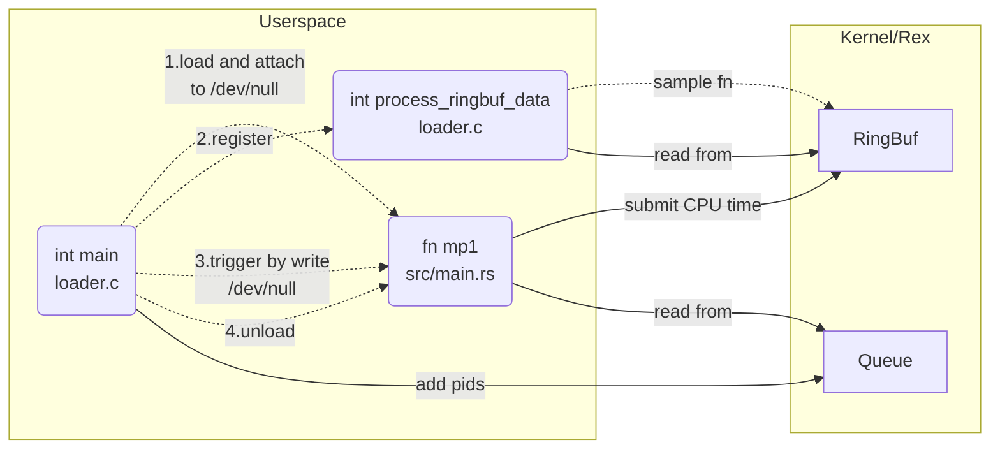

# MP4: Rex kernel extensions

> [!IMPORTANT]
> For this MP you need work on the x86-64 architecture. We assume the x86-64 architecture and ABI in this writeup. Engineering-IT has provided x86-64 VMs for all students, please refer to Piazza post for the access.
> 
> This documentation is shipped with your starter code, but please always refer to https://github.com/cs423-uiuc-fall25/rex-mp4-template for the most recent version.
>
> Claim this MP at https://classroom.github.com/a/DeVJRMF3

## Introduction

The emergence of verified eBPF bytecode is ushering in a new era of safe kernel extensions. In this paper, we argue that eBPF’s verifier—the source of its safety guarantees—has become a liability. In addition to the well-known bugs and vulnerabilities stemming from the complexity and ad hoc nature of the in-kernel verifier, we highlight a concerning trend in which escape hatches to unsafe kernel functions (in the form of helper functions) are being introduced to bypass verifier-imposed limitations on expressiveness, unfortunately also bypassing its safety guarantees. We propose safe kernel extension frameworks using a balance of not just static but also lightweight runtime techniques. We describe a design centered around kernel extensions in safe Rust that will eliminate the need of the in-kernel verifier, improve expressiveness, allow for reduced escape hatches, and ultimately improve the safety of kernel extensions.

The basic ideas are documented in original [README](./REX.md) and [this ATC'25 paper](https://www.usenix.org/system/files/atc25-jia.pdf) (no need to read through).

## Problem Description

Your task is to implement a Rex kernel extension program that reads and pass CPU time for registered pids between kernel and userspace (the same as what we did in mp1). This is conceptually straightforward. However, the real challenge lies in mastering Rex operations and integrating them with your knowledge of Linux kernel programming, Rust programming, and other essential aspects like ELF (Executable and Linkable Format). This task will test your technical skills and ability to quickly adapt to new programming environments.

To implement the program, your objective is to

1. Write a Rex program (`samples/mp1/src/main.rs`) that reads pids from the queue, looks up its CPU time and pass the result to the ring buffer. Static definition of queue and ring buffer are already provided.
2. Write a C program (`samples/mp1/loader.c`) that
   - Downloads (to kernel) the Rex program above and hook it upon writes to `/dev/null` (the hook is already provided above)
   - Passes pids from arguments to the queue
   - Uses (how?) `process_ringbuf_data` to print CPU time from ring buffer
   - Triggers the aforementioned Rex program by writting anything to `/dev/null`

> [!TIP]
> We provide a test script (`samples/mp4/test.sh`) to help check your implementation by yourselves.
>
> Useful references: [eBPF Docs](https://docs.ebpf.io/ebpf-library/libbpf/userspace/), [Rex README](./Rex.md)

**Overall Structure**



`...`: "meta" control flow

`-->`: data flow

## Environment Setup

#### Repo Setup

```bash
cd YOUR_MP4_REPO
git submodule update --init --progress
```

#### Dependencies

Here we assume you are using VM provided. If you work on your own setups please refer to full documentations in [docs/getting-started.md](./docs/getting-started.md). Nix is also supported.

```bash
bash -c "$(wget -O - https://apt.llvm.org/llvm.sh)" # install llvm
sudo apt install zsh cmake elfutils libstdc++-13-dev meson-1.5 mold ninja-build python3 qemu-system bindgen lld flex bison pkgconf libelf-dev libssl-dev # instaill build dependencies
sudo update-alternatives --install /usr/bin/clang  clang  /usr/bin/clang-20  200 # alias for clang
sudo update-alternatives --install /usr/bin/clang++ clang++ /usr/bin/clang++-20 200
```

#### Build

Please follow build steps with `meson` in [docs/getting-started.md](./docs/getting-started.md). To be noted, this can take a long time, you can try using [tmux](https://manpages.ubuntu.com/manpages/noble/en/man1/tmux.1.html) to keep the job running in background.

#### Run and Test

- Try examples provided by Rex

- Once you complete the implementation, you can test them out using `zsh test.sh`

